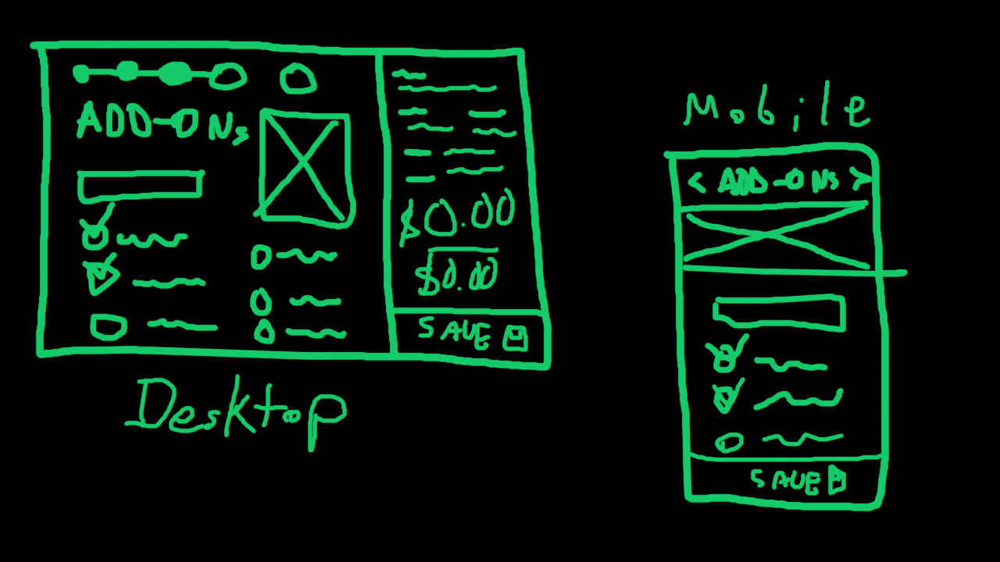

# 🚛 HikerTrailer Custom Builder
A custom trailer build configurator.

* [Current Spreadsheet]('./assets/configurator.xlsx)
* [Wireframe PSD](./assets/wireframe.psd)

## Initial Questions
* Does this need to integrate with Shopify or Woocommerce? Currently there is a Shopify site.

## Roadmap 🛣

We'll build an awesome, fast UI using a JS Framework, such as [React](https://reactjs.org/).

Something like this (TBD):

---

### Tech Options

#### **Wordpress backend**
  
  😄 PROS
  
  * Easily embed anywhere on the site
  * Would allow for close integration with WP/WooCommerce
  * Baked-in user accounts and Schemas
  * Already have infustructure (WPEngine)
  
  ☹ CONS

  * Not as nice dev experience (No version control, which makes code collaboration hard)
  * Harder to maintain
  * tightly-coupled with the WP site (if the site goes down, the app does too)

#### **MERN** (Mongo/Express/React/Node)

  😄 PROS

  * Total control of everything, fully customizable
  * Would be separate, fullstack app
  * More choices of DB
  * Much better dev experience (This one is for us 😁), easier to maintain (to me, at least)
  * loosely-coupled with site (if the site goes down, the app still runs)

  ☹ CONS

  * Would need to develop DB, Schemas, Authentication ourselves
  * Would need new infrastructure/services (Heroku/Mongo Atlas)

---

### Phase 1
* [ ] Custom UI - responsive, fast
* [ ] Generate the various documents out of user input data
  * Purchase Agreement
  * Final Build Sheet
  * Bill of Sale
  * Traveler
  * Dump of user input
* [ ] Send all of this data somewhere
  * Could dump data into email and send (quick and easy)
  * Drop data into a Google Sheet or DB (longer dev time)
* [ ] Wrap UI in WP plugin 
  * (if we're planning on embedding this in the WP site)

### Phase 2
* [ ] Decide on final Backend/DB
  * Could use WP as a backend - depends how closely they want to integrate this build with WP
  * Node/Express/DB backend
* [ ] User Accounts - Admins and Customers
  * Customers can create configurations
  * Admins can view/edit a Customer's config
* [ ] User can save multiple configurations

### Phase 3
* [ ] Create 3D Models
* [ ] Integrate 3D Models into UI

---